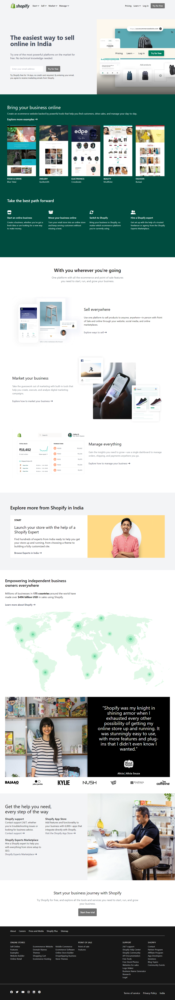

# This is a Shopify-Clone Page

## Deployed Link

[Project Link](https://phani-sai-shopify-clone.netlify.app/)

## Preview:

## Built with:

- TailWind CSS

## Key learnings:

- Learned to handle CSS Classes making responsive view using Tailwind CSS Media Querys and desktop view in HTML File without separate CSS file. 

## Time taken:

- I took 18hrs to build from scratch working atleast 2hrs per day for a 8days.
